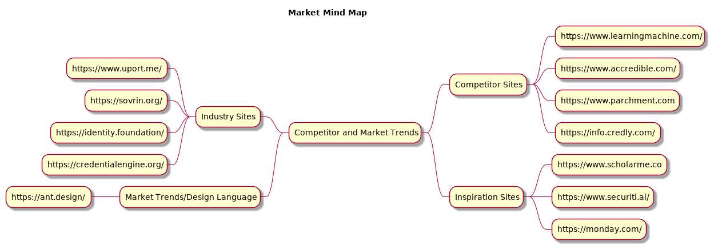

# Website

## ANALYSIS OF TOP COMPETITORS AND THE MARKET
### Key Competitors:
1. https://www.learningmachine.com/
2. https://www.accredible.com/
3. https://www.parchment.com
4. https://info.credly.com/ 
### Inspirations
1. https://www.scholarme.co/#titles
2. https://www.securiti.ai/
3. https://monday.com/

### Industry Sites
1. https://www.uport.me/
2. https://sovrin.org/
3. https://identity.foundation/
4. https://credentialengine.org/
### Market Trends
1. https://ant.design/

### Keywords:  Related to your industry/ market/ audience here
* Education Credentials
* Self-Sovereign Identity
* Decentralized Record Storage
* Blockchain

