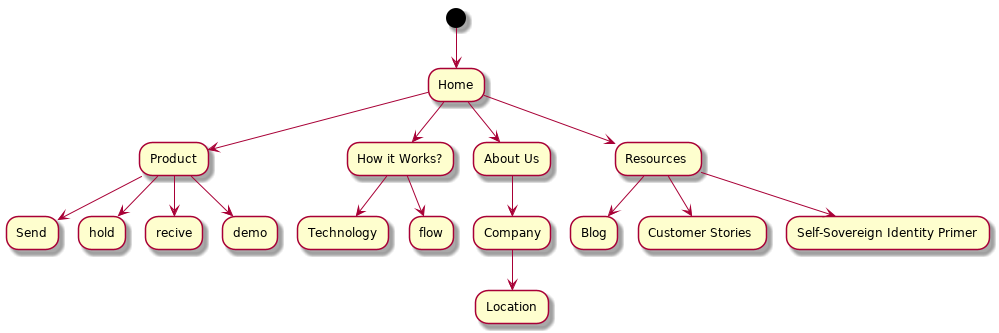

# Website

## PHASE 1: PRE – PLANNING

### ANALYSIS OF TOP COMPETITORS AND THE MARKET
#### Key Competitors:
1. https://www.learningmachine.com/
2. https://www.accredible.com/
3. https://www.parchment.com
4. https://info.credly.com/ 
#### Inspirations
1. https://www.scholarme.co/#titles
2. https://www.securiti.ai/
3. https://monday.com/

#### Industry Sites
1. https://www.uport.me/
2. https://sovrin.org/
3. https://identity.foundation/
4. https://credentialengine.org/
#### Market Trends
1. https://ant.design/

#### Keywords:  Related to your industry/ market/ audience here
* Education Credentials
* Self-Sovereign Identity
* Decentralized Record Storage
* Blockchain

## PHASE 2: INFORMATION ARCHITECTURE AND USER FLOWS
## WEBSITE STRUCTURE

### NAVIGATION FLOW
Using a flowchart, you can map how your visitor would navigate through your site. Identifying this will help you decide on the key phrases, key paragraphs, key images etc. you should place on each page

ADD NAVIGATION FLOW

## PHASE 3: DESIGN LAYOUTS AND SITE INFRASTRUCTURE

### KEY COLORS, ELEMENTS AND STYLES
ADD MOODBOARD

### WIREFRAMES
ADD Wireframes

### UI MOCKUPS
ADD Wireframes

##PHASE 4: PROMOTION AND MARKETING

###WEBSITE PROMOTION AND MARKETING
Building your website is just the initial phase of it all. Then comes marketing. There are several ways you can promote and drive traffic to your website. Get your team together and sketch out a step by step plan on how to get your website in front of an interested audience 

